# DeepSeek GRPO for Authentication Analysis

This project implements a memory-optimized version of DeepSeek's GRPO (Generative Reinforcement from Preference Optimization) for fine-tuning LLMs to analyze authentication logs. The implementation is specifically designed to work on machines with limited GPU memory (8GB) and moderate RAM (32GB).

## Training Pipeline Overview

The training pipeline follows the GRPO methodology with memory optimizations:

```mermaid

flowchart TD
    %% Main flow
    start([Start]) --> config[Load Configuration]
    config --> tokenizer["Initialize DeepSeek Tokenizer"]
    tokenizer --> data_proc["Initialize Data Processor\nAuth logs + JSON annotations"]
    
    %%Memory optimization techniques - global
    %% mem_opt[/"Memory Optimization Techniques"/]
    %% mem_opt --> quant["4-bit Quantization\nbnb_4bit_use_double_quant=True\nbnb_4bit_quant_type=nf4"]
    %% mem_opt --> lora["LoRA with small rank (r=4)\ntarget_modules=q_proj,k_proj,v_proj,o_proj"]
    %% mem_opt --> dev_map["Mixed Device Mapping\nCritical layers on GPU\nOther layers on CPU"]
    %% mem_opt --> gc["Aggressive GPU Clearing\ngc.collect()\ntorch.cuda.empty_cache()"]
    %% mem_opt --> seq_len["Reduced Sequence Length\nmax_seq_length=1024"]
    
    %% SFT training section
    subgraph SFT["Supervised Fine-Tuning (SFT)"]
        sft_data["Prepare SFT Dataset\nAuth logs + expert annotations"] --> sft_model["Load 4-bit Quantized Base Model\nDeepSeek-8B"]
        sft_model --> add_lora1["Add LoRA Adapter\nrank=4, target=attention layers"]
        add_lora1 --> sft_train["Custom Training Loop\nGradient Accumulation Steps=16\nBatch Size=1"]
        sft_train --> sft_opt["Adafactor Optimizer\nlr=2e-5\nscale_parameter=False\nrelative_step=False"]
        sft_opt --> sft_loss["Causal LM Loss\noutputs = model(**batch)\nloss = outputs.loss / accumulation_steps"]
        sft_loss --> sft_track["Loss Tracking\nepoch_loss += loss.item() * accumulation_steps\navg_epoch_loss = epoch_loss / steps"]
        sft_track --> sft_cache["GPU Memory Clearing\nEvery 5 steps\nclear_gpu_memory()"]
        sft_cache --> sft_save["Save LoRA Adapter\nmodel.save_pretrained()"]
    end
    
    %% Reward Model training section
    subgraph RM["Reward Model Training"]
        pref_data["Prepare Preference Dataset\nChosen/Rejected Pairs"] --> mem_check{"Memory Check\n≥ 7GB?"}
        mem_check -->|"Yes"| rm_model["Load Classification Model\nmodel_type='seq_cls'\nnum_labels=1"]
        mem_check -->|"No"| alt_rm["Alternative Reward Model\nmetadata-based heuristic\npositive keywords: suspicious, anomalous\nnegative keywords: benign, legitimate"]
        
        rm_model --> add_lora2["Add LoRA Adapter\ntask_type=TaskType.SEQ_CLS"]
        add_lora2 --> rm_batch["Chunk Processing\nchunk_size=4\nProcess items individually"]
        rm_batch --> rm_opt["AdamW Optimizer\nlr=2e-5\nweight_decay=0.01"]
        rm_opt --> rm_loss["Bradley-Terry Loss\n-torch.log(sigmoid(chosen_rewards - rejected_rewards))\nloss = loss.mean() / grad_acc_steps"]
        rm_loss --> rm_track["Loss Tracking\nepoch_loss += loss.item() * grad_acc_steps\navg_loss = epoch_loss / num_batches"]
        rm_track --> rm_free["Explicit Memory Freeing\ndel tensors after each item"]
        rm_free --> rm_save["Save Reward Model"]
        
        alt_rm --> rm_save
    end
    
    %% RL training section
    subgraph RL["Reinforcement Learning (Simplified PPO)"]
        rl_data["Load High-Quality Examples\nmax_samples=20"] --> load_sft["Load SFT Model with Adapter"]
        load_sft --> add_lora3["Load LoRA Adapter\nFallback to new adapter if loading fails"]
        add_lora3 --> rl_batch["Minimal Batch Processing\nbatch_size=1\naccumulation_steps=4"]
        rl_batch --> rl_opt["Adafactor with Reduced LR\nlr=learning_rate/2\nscale_parameter=False"]
        rl_opt --> rl_limit["Limited Training Steps\nsteps=50\nRobust batch processing with try-except"]
        rl_limit --> rl_loss["Policy Optimization\noutputs = model(**batch)\nloss = outputs.loss / accumulation_steps"]
        rl_loss --> rl_track["Loss Tracking\ntotal_loss += loss.item() * accumulation_steps\navg_loss = total_loss / step"]
        rl_track --> rl_save["Save RL Model"]
    end
    
    %% Inference section
    subgraph INFER["Inference"]
        infer_input["Authentication Data Input"] --> model_check{"Model\nAvailability\nCheck"}
        model_check -->|"RL exists"| use_rl["Use RL Model"]
        model_check -->|"RL missing"| use_sft["Fallback to SFT Model"]
        model_check -->|"Both missing"| use_base["Fallback to Base Model"]
        
        use_rl --> infer_gen["Generation with Parameters\ntemperature=0.2\ntop_p=0.9\nrepetition_penalty=1.2"]
        use_sft --> infer_gen
        use_base --> infer_gen
        
        infer_gen --> json_extract["JSON Extraction\nCleanup for valid JSON\nFix trailing commas, nested quotes"]
        json_extract --> output["Output Structured\nAuthentication Analysis"]
    end
    
    %% Connect main sections
    data_proc --> SFT
    SFT --> RM
    RM --> RL
    RL --> INFER
    
    %% Connect memory optimization to relevant parts
    mem_opt -.-> SFT
    mem_opt -.-> RM
    mem_opt -.-> RL
    
    %% Styling
    classDef memoryOpt fill:#f9f,stroke:#333,stroke-width:1px;
    class mem_opt,quant,lora,dev_map,gc,seq_len memoryOpt;
    
    classDef losses fill:#bbf,stroke:#333,stroke-width:1px;
    class sft_loss,rm_loss,rl_loss losses;
    
    classDef fallbacks fill:#fdd,stroke:#333,stroke-width:1px;
    class alt_rm,use_sft,use_base fallbacks;


```



### Training Steps

1. **Supervised Fine-Tuning (SFT)**
   - Uses authentication logs paired with expert JSON annotations
   - Implements custom training loop with memory optimizations
   - Tracks average epoch loss as `epoch_loss / steps`
   - Uses Adafactor optimizer with configurable learning rate

2. **Reward Model Training**
   - Creates preference pairs (chosen/rejected examples)
   - Uses Bradley-Terry loss: `-log(sigmoid(chosen_rewards - rejected_rewards))`
   - Performs memory check - uses different approaches based on available GPU memory
   - Falls back to a heuristic-based model if memory is insufficient

3. **Reinforcement Learning (Simplified PPO)**
   - Implements a memory-efficient version of Proximal Policy Optimization
   - Uses the SFT model as starting point
   - Trains on high-quality examples with reduced learning rate
   - Limits training to a small number of steps (50) to prevent overfitting

4. **Inference**
   - Uses the final trained model to generate structured authentication analysis
   - Implements robust JSON extraction for reliable outputs

## Project Structure

The codebase is organized into modular components:

```
├── config.py           # Configuration settings and utilities
├── data_processor.py   # Data loading and preprocessing
├── model_utils.py      # Model initialization and utilities
├── sft_trainer.py      # Supervised Fine-Tuning module
├── reward_trainer.py   # Reward model training module
├── rl_trainer.py       # Reinforcement Learning module
├── inference.py        # Inference functionality
├── main.py             # Main script to run the pipeline
└── schema.json         # JSON schema for authentication analysis
```

## Requirements

- Python 3.8+
- PyTorch 2.0+
- CUDA-compatible GPU with at least 8GB VRAM (will fallback to CPU if needed)
- 16GB+ system RAM

### Python Dependencies

```
torch>=2.0.0
transformers>=4.30.0
peft>=0.4.0
trl>=0.4.7
accelerate>=0.20.0
bitsandbytes>=0.39.0
datasets>=2.12.0
pandas>=1.5.0
numpy>=1.24.0
```

## Installation

1. Clone this repository:
```bash
git clone https://github.com/yourusername/deepseek-auth-analysis.git
cd deepseek-auth-analysis
```

2. Create a virtual environment and install dependencies:
```bash
python -m venv venv
source venv/bin/activate  # On Windows: venv\Scripts\activate
pip install -r requirements.txt
```

## Data Format

The system expects data in a specific directory structure:

```
data/
├── auth_data/
│   └── benign/
│       ├── auth_data_1_165.txt
│       ├── auth_data_2_166.txt
│       └── ...
└── Auth_bin/
    ├── auth_text_1_165.json
    ├── auth_text_2_166.json
    └── ...
```

Each `auth_data_X_Y.txt` file contains raw authentication logs, while the corresponding `auth_text_X_Y.json` contains the expert-annotated security analysis in JSON format.

## Usage

### Training

To run the complete training pipeline:

```bash
python main.py train --data_dir /path/to/data --output_dir ./models --samples 100
```

To train only a specific stage:

```bash
# Train only the SFT model
python main.py train --data_dir /path/to/data --stage sft

# Train only the reward model
python main.py train --data_dir /path/to/data --stage reward

# Train only the RL model
python main.py train --data_dir /path/to/data --stage rl
```

If you have very limited GPU memory, you can force CPU training (very slow but will complete):

```bash
python main.py train --data_dir /path/to/data --cpu
```

### Inference

To analyze authentication data using a trained model:

```bash
python main.py infer --model_dir ./models --input_file auth_data.txt --output_file analysis.json
```

To use the full schema in the prompt (may improve results at the cost of more tokens):

```bash
python main.py infer --model_dir ./models --input_file auth_data.txt --full_schema
```
Example:

```bash
python main.py infer --model_dir ./models --input_file auth_data\malicious\auth_data_29627150_150885.txt
```
## Memory Optimization Techniques

This implementation uses several techniques to run on hardware with limited memory:

1. **4-bit Quantization**: Reduces model memory footprint by 8x
2. **Parameter-Efficient Fine-Tuning**: Uses LoRA with small rank (r=4)
3. **Gradient Accumulation**: Enables training with very small batch sizes
4. **Reduced Sequence Length**: Uses 1024 tokens instead of 2048
5. **CPU Offloading**: Places some model layers on CPU
6. **Simplified PPO**: Uses memory-efficient policy optimization instead of full PPO
7. **Custom Training Loops**: Avoids memory issues with Hugging Face Trainer
8. **Memory Clearing**: Aggressively cleans up GPU memory
9. **Alternative Fallbacks**: Uses simplified approaches when full training is infeasible
10. **Reduced Dataset Size**: Limits training to small subsets of data

## Loss Calculation Details

1. **SFT Loss**: Standard causal language modeling loss
   ```python
   # From sft_trainer.py
   outputs = model(**batch)
   loss = outputs.loss / accumulation_steps
   epoch_loss += loss.item() * accumulation_steps
   avg_epoch_loss = epoch_loss / steps
   ```

2. **Reward Model Loss**: Bradley-Terry loss for preference learning
   ```python
   # From reward_trainer.py
   chosen_rewards = chosen_outputs.logits.squeeze()
   rejected_rewards = rejected_outputs.logits.squeeze()
   loss = -torch.log(torch.sigmoid(chosen_rewards - rejected_rewards))
   loss = loss.mean() / grad_acc_steps
   epoch_loss += loss.item() * grad_acc_steps
   avg_loss = epoch_loss / num_batches
   ```

3. **Simplified PPO Loss**: Policy optimization with simplified objective
   ```python
   # From rl_trainer.py
   outputs = model(**batch)
   loss = outputs.loss / accumulation_steps
   total_loss += loss.item() * accumulation_steps
   avg_loss = total_loss / step
   ```

## Extending the Project

- **Different Models**: To use a different base model, modify the `model_name` in `config.py`
- **Custom Schemas**: Edit `schema.json` to change the output format
- **Additional Tasks**: The GRPO framework can be adapted to other analysis tasks

## Troubleshooting

### Common Issues

- **Out of Memory (OOM) Errors**: Try reducing `max_train_samples` or use `--cpu` flag
- **CUDA Error: device-side assert triggered**: Check your CUDA and PyTorch versions for compatibility
- **Poor JSON Generation**: Consider increasing training epochs or using `--full_schema` during inference
- **Slow Training**: CPU training is extremely slow; consider using Google Colab or other cloud GPUs

## License

This project is released under the MIT License.git init
